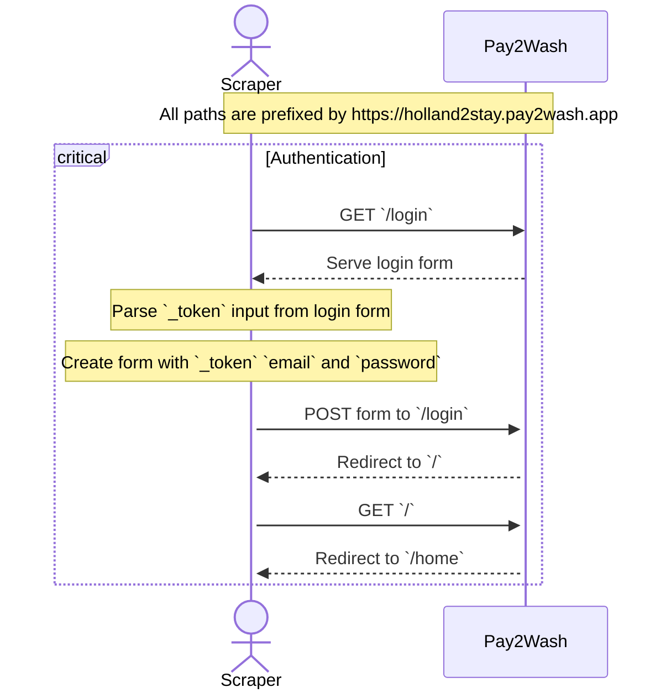

# Pain2Watch

method:

`url: $('#app_uri').val() + '/machine_statuses/' + $('#location').val(),`

```mermaid
sequenceDiagram
    actor C as Scraper
    participant S as Pay2Wash

    Note over C,S: All paths are prefixed by https://holland2stay.pay2wash.app

    critical Authentication
    C->>S: GET `/login`
    S-->>C: Serve login form
    activate C
    activate S
    Note over C: Parse `_token` input from login form
    Note over C: Create form with `_token` `email` and `password`
    C->>S: POST form to `/login`
    S-->>C: Redirect to `/`
    C->>S: GET `/`
    S-->>C: Redirect to `/home`
    end
```
