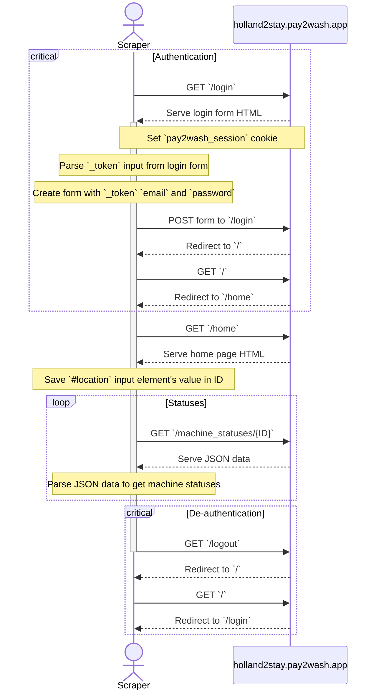

# Pain2Wash

## TODO

- [ ] Enable Sentry
- [ ] https://doc.rust-lang.org/stable/std/ops/enum.ControlFlow.html

## Scrape Sequence

```mermaid
sequenceDiagram
    actor C as Scraper
    participant S as holland2stay.pay2wash.app

    critical Authentication
    C->>S: GET `/login`
    S-->>+C: Serve login form HTML
    Note over S,C: Set `pay2wash_session` cookie
    Note over C: Parse `_token` input from login form
    Note over C: Create form with `_token` `email` and `password`
    C->>S: POST form to `/login`
    S-->>C: Redirect to `/`
    C->>S: GET `/`
    S-->>C: Redirect to `/home`
    end


    C->>S: GET `/home`
    S-->>C: Serve home page HTML
    Note over C: Save `#35;location` input element's value in ID

    loop Statuses
    C->>S: GET `/machine_statuses/{ID}`
    S-->>C: Serve JSON data
    Note over C: Parse JSON data to get machine statuses
    end

    critical De-authentication
    C->>-S: GET `/logout`
    S-->>C: Redirect to `/`
    C->>S: GET `/`
    S-->>C: Redirect to `/login`
    end
```
